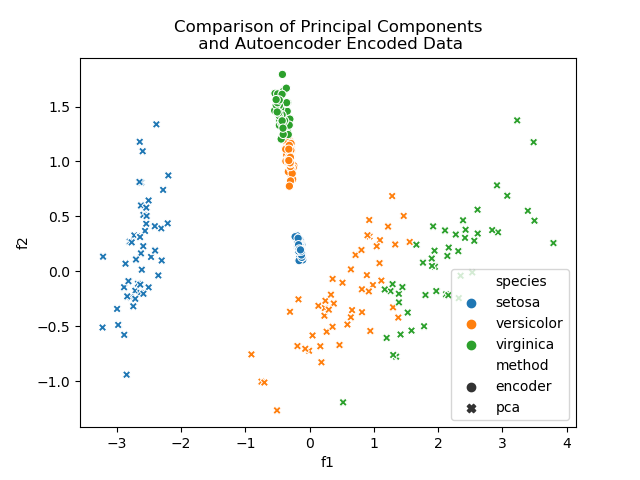

# Dimensionality Reduction using an Autoencoder and Principal Component Analysis
A small experiment in dimensionality reduction using an Autoencoder, with the results compared to that of Principal 
Component Analysis. The test dataset used is the Iris dataset (from Seaborn's built-in datasets).

The graph below shows a sample of the results obtained, illustrating he linear separability of the features in 
lower dimensions.

The Autoencoder is created using Keras' Sequential API, while the Principal Component decomposition is done using
SciKit-Learn's built-in PCA functionality. 

### Running the script:
Install the necessary requirements by running:

`pip install -r requirements.txt`

Execute the `autoencoder` module by running:

`python -m autoencoder`

The script will produce a graph similar to those given in the `results` folder, and will save generated data 
(principal components and encoded features) to a __.csv__ file.

The `__main__.py` file inside the `autoencoder` module contains parameters which can be customised to change the number
of nodes in the hidden layers, the number of encoded features/principal components to generate (i.e. the reduced 
dimension size of the patterns), etc.